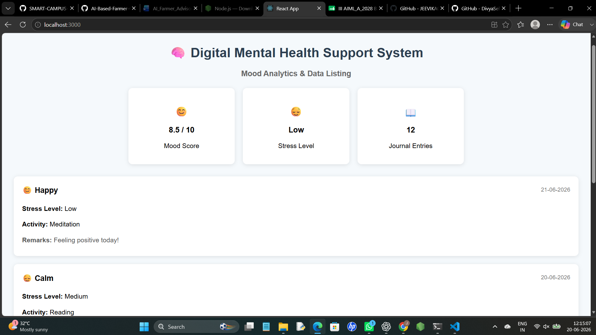

# CODE 
    function App() {
    const records = [
    {
      date: "21-06-2026",
      mood: "😊 Happy",
      stress: "Low",
      activity: "Meditation",
      remarks: "Feeling positive today!",
    },
    {
      date: "20-06-2026",
      mood: "😌 Calm",
      stress: "Medium",
      activity: "Reading",
      remarks: "Relaxed and at peace.",
    },
    {
      date: "19-06-2026",
      mood: "🤩 Excited",
      stress: "Low",
      activity: "Walking",
      remarks: "Great energy all day.",
    },
    {
      date: "18-06-2026",
      mood: "😊 Relaxed",
      stress: "Low",
      activity: "Music Therapy",
      remarks: "A calm, soothing evening.",
    },
    ];

    return (
    

      <h1 style={{ textAlign: "center", color: "#2c3e50" }}>
        🧠 Digital Mental Health Support System
      </h1>

      <h3 style={{ textAlign: "center", color: "#666" }}>
        Mood Analytics & Data Listing
      </h3>

      

        

          <h2>😊</h2>
          <h3>8.5 / 10</h3>
          
Mood Score

        

        

          <h2>😌</h2>
          <h3>Low</h3>
          
Stress Level

        

        

          <h2>📖</h2>
          <h3>12</h3>
          
Journal Entries

        

      

      

        {records.map((record, index) => (
          

            

              <h3 style={{ margin: 0 }}>{record.mood}</h3>
              {record.date}
            

            

              <strong>Stress Level:</strong> {record.stress}
            

            

              <strong>Activity:</strong> {record.activity}
            

            

              <strong>Remarks:</strong> {record.remarks}
            

          

        ))}
      

      

        💚 Wellness Insight:
         
        Your mood has improved by 20% this week.
      

    

    );
    }

    const card = {
     background: "white",
     padding: "20px",
     width: "220px",
     textAlign: "center",
     borderRadius: "10px",
     boxShadow: "0px 2px 10px rgba(0,0,0,0.1)",
     };

    const recordCard = {
     background: "white",
     padding: "20px",
     borderRadius: "10px",
     boxShadow: "0px 2px 10px rgba(0,0,0,0.1)",
     display: "flex",
        flexDirection: "column",
    };

    const recordHeader = {
     display: "flex",
     justifyContent: "space-between",
     alignItems: "center",
     marginBottom: "15px",
     };

    export default App;

# DATA LISTING MODULE

## Overview

The Data Listing Module displays user mood records and wellness activities in a structured tabular format. It helps users review their emotional history and wellness progress.

## Features

- Mood History Tracking
- Stress Level Monitoring
- Activity Records
- Summary Statistics
- Organized Table View

## Screenshot

## Deliverable

Data Listing Module Successfully Developed.
