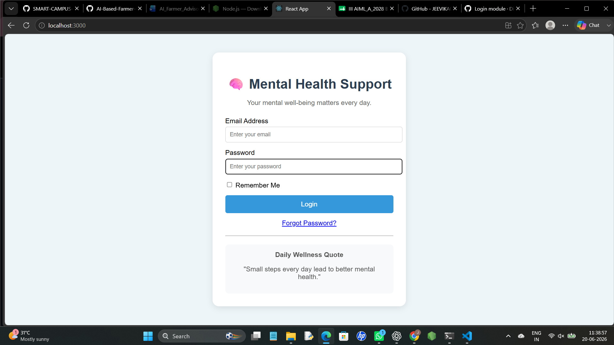

# CODE 
    import React, { useState } from "react";

    function App() {
      const [email, setEmail] = useState("");
      const [password, setPassword] = useState("");

      const handleLogin = (e) => {
        e.preventDefault();

        if (!email || !password) {
          alert("Please enter Email and Password");
          return;
        }

        alert("Login Successful!");
      };

      return (
        

      

        <h1
          style={{
            textAlign: "center",
            color: "#2c3e50",
            marginBottom: "10px",
          }}
        >
          🧠 Mental Health Support
        </h1>

        

          Your mental well-being matters every day.
        

        <form onSubmit={handleLogin}>
          <label>Email Address</label>
          <input
            type="email"
            placeholder="Enter your email"
            value={email}
            onChange={(e) => setEmail(e.target.value)}
            style={{
              width: "100%",
              padding: "10px",
              marginTop: "5px",
              marginBottom: "15px",
              borderRadius: "5px",
              border: "1px solid #ccc",
            }}
          />

          <label>Password</label>
          <input
            type="password"
            placeholder="Enter your password"
            value={password}
            onChange={(e) => setPassword(e.target.value)}
            style={{
              width: "100%",
              padding: "10px",
              marginTop: "5px",
              marginBottom: "15px",
              borderRadius: "5px",
              border: "1px solid #ccc",
            }}
          />

          

            <input type="checkbox" /> Remember Me
          

          <button
            type="submit"
            style={{
              width: "100%",
              padding: "12px",
              backgroundColor: "#3498db",
              color: "white",
              border: "none",
              borderRadius: "5px",
              cursor: "pointer",
              fontSize: "16px",
            }}
          >
            Login
          </button>
        </form>

        

          <a href="/">Forgot Password?</a>
        

        

        

          <strong>Daily Wellness Quote</strong>
          

            "Small steps every day lead to better mental health."
          

        

      

    

    );
    }

    export default App;
   

# LOGIN MODULE

## Overview

The Login Module provides secure access to registered users of the Digital Mental Health Support System. Users enter their email and password to access the application.

## Features

- User Authentication
- Email Validation
- Password Validation
- Error Handling
- Secure Login Access

## Workflow

1. User enters email address.
2. User enters password.
3. System validates credentials.
4. User is redirected after successful login.

## Screenshot

## Deliverable

Functional Login Page Developed.

