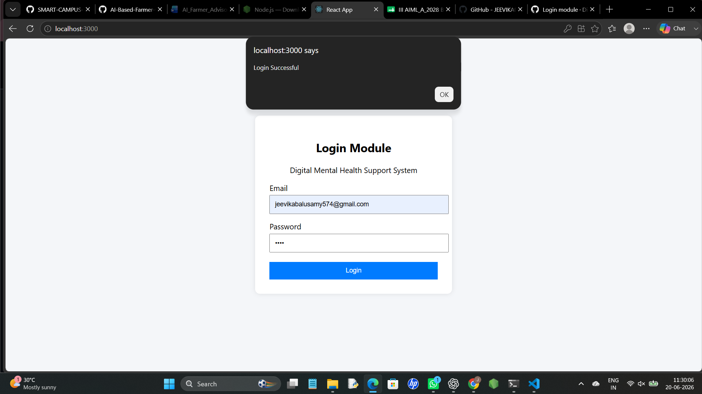

# CODE 
import React, { useState } from "react";

function App() {
  const [email, setEmail] = useState("");
  const [password, setPassword] = useState("");

  const handleLogin = (e) => {
    e.preventDefault();

    if (email === "" || password === "") {
      alert("Please fill all fields");
    } else {
      alert("Login Successful");
    }
  };

  return (
    

      

        <h2 style={{ textAlign: "center" }}>Login Module</h2>
        

          Digital Mental Health Support System
        

        <form onSubmit={handleLogin}>
          <label>Email</label>
          <input
            type="email"
            placeholder="Enter Email"
            value={email}
            onChange={(e) => setEmail(e.target.value)}
            style={{
              width: "100%",
              padding: "10px",
              marginTop: "5px",
              marginBottom: "15px",
            }}
          />

          <label>Password</label>
          <input
            type="password"
            placeholder="Enter Password"
            value={password}
            onChange={(e) => setPassword(e.target.value)}
            style={{
              width: "100%",
              padding: "10px",
              marginTop: "5px",
              marginBottom: "20px",
            }}
          />

          <button
            type="submit"
            style={{
              width: "100%",
              padding: "10px",
              backgroundColor: "#007bff",
              color: "white",
              border: "none",
              cursor: "pointer",
            }}
          >
            Login
          </button>
        </form>
      

    

  );
}

export default App;

# LOGIN MODULE

## Overview

The Login Module provides secure access to registered users of the Digital Mental Health Support System. Users enter their email and password to access the application.

## Features

- User Authentication
- Email Validation
- Password Validation
- Error Handling
- Secure Login Access

## Workflow

1. User enters email address.
2. User enters password.
3. System validates credentials.
4. User is redirected after successful login.

## Screenshot

## Deliverable

Functional Login Page Developed.

